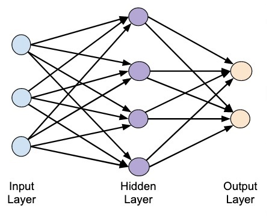

# Neural-Network

**Biological Neuron**

A human brain has billions of neurons. Neurons are interconnected nerve cells in the human brain that are involved in processing and transmitting chemical and electrical signals. Dendrites are branches that receive information from other neurons.

**Artificial Neuron**

An artificial neuron is a mathematical function based on a model of biological neurons, where each neuron takes inputs, weighs them separately, sums them up and passes this sum through a nonlinear function to produce output.

**Perceptron**

A perceptron is a neural network unit (an artificial neuron) that does certain computations to detect features or business intelligence in the input data.

**Three Layered Neural Network**

Three Layered Neural Network contains three layers that are

1) Input Layer
2) Hidden Layer
3) Output Layer

Three three layers all together can comprise any number of neurons.

**How Neural Networks work?**

Information flows through a neural network in two ways. When it's learning (being trained) or operating normally (after being trained), patterns of information are fed into the network via the input units, which trigger the layers of hidden units, and these in turn arrive at the output units. This common design is called a feedforward network. Not all units "fire" all the time. Each unit receives inputs from the units to its left, and the inputs are multiplied by the weights of the connections they travel along. Every unit adds up all the inputs it receives in this way and (in the simplest type of network) if the sum is more than a certain threshold value, the unit "fires" and triggers the units it's connected to (those on its right).

For a neural network to learn, there has to be an element of feedback involved—just as children learn by being told what they're doing right or wrong. In fact, we all use feedback, all the time. Think back to when you first learned to play a game like ten-pin bowling. As you picked up the heavy ball and rolled it down the alley, your brain watched how quickly the ball moved and the line it followed, and noted how close you came to knocking down the skittles. Next time it was your turn, you remembered what you'd done wrong before, modified your movements accordingly, and hopefully threw the ball a bit better. So you used feedback to compare the outcome you wanted with what actually happened, figured out the difference between the two, and used that to change what you did next time ("I need to throw it harder," "I need to roll slightly more to the left," "I need to let go later," and so on). The bigger the difference between the intended and actual outcome, the more radically you would have altered your moves.

Neural networks learn things in exactly the same way, typically by a feedback process called backpropagation (sometimes abbreviated as "backprop"). This involves comparing the output a network produces with the output it was meant to produce, and using the difference between them to modify the weights of the connections between the units in the network, working from the output units through the hidden units to the input units—going backward, in other words. In time, backpropagation causes the network to learn, reducing the difference between actual and intended output to the point where the two exactly coincide, so the network figures things out exactly as it should.
