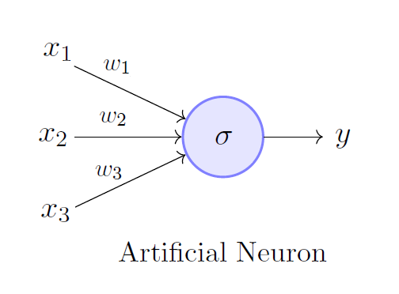
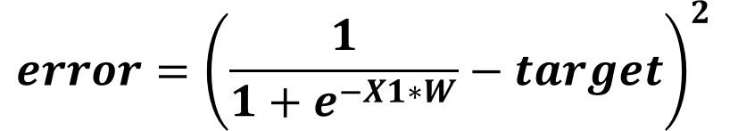

# Neural-Network

**Biological Neuron**

A human brain has billions of neurons. Neurons are interconnected nerve cells in the human brain that are involved in processing and transmitting chemical and electrical signals. Dendrites are branches that receive information from other neurons.

**Artificial Neuron**

An artificial neuron is a mathematical function based on a model of biological neurons, where each neuron takes inputs, weighs them separately, sums them up and passes this sum through a nonlinear function to produce output.

**Perceptron**

A perceptron is a neural network unit (an artificial neuron) that does certain computations to detect features or business intelligence in the input data.

**Three Layered Neural Network**

Three Layered Neural Network contains three layers that are

1) Input Layer
2) Hidden Layer
3) Output Layer

These three layers all together can comprise any number of neurons.

**How Neural Networks work?**

Information flows through a neural network in two ways. When it's learning (being trained) or operating normally (after being trained), patterns of information are fed into the network via the input units, which trigger the layers of hidden units, and these in turn arrive at the output units. This common design is called a feedforward network. Not all units "fire" all the time. Each unit receives inputs from the units to its left, and the inputs are multiplied by the weights of the connections they travel along. Every unit adds up all the inputs it receives in this way and (in the simplest type of network) if the sum is more than a certain threshold value, the unit "fires" and triggers the units it's connected to (those on its right).

For a neural network to learn, there has to be an element of feedback involved—just as children learn by being told what they're doing right or wrong. In fact, we all use feedback, all the time. Think back to when you first learned to play a game like ten-pin bowling. As you picked up the heavy ball and rolled it down the alley, your brain watched how quickly the ball moved and the line it followed, and noted how close you came to knocking down the skittles. Next time it was your turn, you remembered what you'd done wrong before, modified your movements accordingly, and hopefully threw the ball a bit better. So you used feedback to compare the outcome you wanted with what actually happened, figured out the difference between the two, and used that to change what you did next time ("I need to throw it harder," "I need to roll slightly more to the left," "I need to let go later," and so on). The bigger the difference between the intended and actual outcome, the more radically you would have altered your moves.

Neural networks learn things in exactly the same way, typically by a feedback process called backpropagation (sometimes abbreviated as "backprop"). This involves comparing the output a network produces with the output it was meant to produce, and using the difference between them to modify the weights of the connections between the units in the network, working from the output units through the hidden units to the input units—going backward, in other words. In time, backpropagation causes the network to learn, reducing the difference between actual and intended output to the point where the two exactly coincide, so the network figures things out exactly as it should.

**How does it work in practice?**

Once the network has been trained with enough learning examples, it reaches a point where you can present it with an entirely new set of inputs it's never seen before and see how it responds. For example, suppose you've been teaching a network by showing it lots of pictures of chairs and tables, represented in some appropriate way it can understand, and telling it whether each one is a chair or a table. After showing it, let's say, 25 different chairs and 25 different tables, you feed it a picture of some new design it's not encountered before—let's say a chaise longue—and see what happens. Depending on how you've trained it, it'll attempt to categorize the new example as either a chair or a table, generalizing on the basis of its past experience—just like a human. Hey presto, you've taught a computer how to recognize furniture!

That doesn't mean to say a neural network can just "look" at pieces of furniture and instantly respond to them in meaningful ways; it's not behaving like a person. Consider the example we've just given: the network is not actually looking at pieces of furniture. The inputs to a network are essentially binary numbers: each input unit is either switched on or switched off. So if you had five input units, you could feed in information about five different characteristics of different chairs using binary (yes/no) answers. The questions might be 1) Does it have a back? 2) Does it have a top? 3) Does it have soft upholstery? 4) Can you sit on it comfortably for long periods of time? 5) Can you put lots of things on top of it? A typical chair would then present as Yes, No, Yes, Yes, No or 10110 in binary, while a typical table might be No, Yes, No, No, Yes or 01001. So, during the learning phase, the network is simply looking at lots of numbers like 10110 and 01001 and learning that some mean chair (which might be an output of 1) while others mean table (an output of 0).

**Algorithm for Training a Neural Network**

There are so many algorithms for training a Neural Network out there like:
1. Gradient descent (I have used this method)
2. Newton method
3. Conjugate gradient
4. Quasi-Newton method
5. Levenberg-Marquardt algorithm

**Gradient Descent:**

I prefer you should refer a *3Blue1Brown youtube channel* for getting a very deep insight of this algoritm. 

This image may make you a little uncomfortable but trust me, It is the most simple algorithm to work with.

**1 Input – 1 Output**
The first step towards the generic implementation of the GD algorithm is to implement it just for a very simple architecture as shown in the figure below. There are only 1 input and 1 output and no hidden layers at all. Before thinking of using the GD algorithm in the backward pass, let's start by the forward pass and see how we can move from the input until calculating the error.

**Forward Pass**
According to the below figure, the input X1 is multiplied by its weight W to return the result X1*W. In the forward pass, it is generally known that each input is multiplied by its associated weight and the products between all inputs and their weights are then summed. This is called the sum of products (SOP). For example, there are 2 inputs X1 and X2 and their weights are W1 and W2, respectively, then the SOP will be X1*W1+X2*W2. In this example, there is only 1 input and thus the SOP is meaningless.

After calculating the SOP, next is to feed it to the activation function in the output layer neuron. Such a function helps to capture the non-linear relationships between the inputs and the outputs and thus increasing the accuracy of the network. In this tutorial, the sigmoid function will be used. Its formula is given in the next figure.

Assuming that the outputs in this example range from 0 to 1, then the result returned from the sigmoid could be regarded as the predicted output. This example is a regression example but it could be converted into a classification example easily by mapping the score returned by the sigmoid to a class label.

After calculating the predicted output, next is to measure the error of prediction using the square error function defined below.

At this time, the forward pass is complete. Based on the calculated error, we can go backward and calculate the weight gradient which is used for updating the current weight.

**Backward Pass**
In the backward pass, we are looking to know how the error changes by changing the network weights. As a result, we want to build an equation in which both the error and the weight exist. How to do that?

According to the previous figure, the error is calculated using 2 terms which are:

1) Predicted

2) Target

Do not forget that the predicted value is calculated as the output of the sigmoid function. Thus, we can substitute by the sigmoid function into the error equation and the result will be as given below. But up this point, the error and the weight are not included in this equation.

This is right but also remember that the sop is calculated as the product between the input X1 and its weight W. Thus, we can remove the sop and use its equivalent X1*W as given below.

At this time, we can start calculating the gradient of the error relative to the weight as given in the next figure. Using the equation below for calculating the gradient might be complex especially when more inputs and weights exist. As an alternative, we can use the chain rule which simplifies the calculations.

**Chain Rule**

When the 2 participants of the gradient, which are the error and W in this example, are not related directly by a single equation, we can follow a chain of derivatives that starts from the error until reaching W. Looking back to the error function, we can find that the prediction is the link between the error and the weight. Thus, we can calculate the first derivative which is the derivative of the error to the predicted output as given below.

After that, we can calculate the derivative of the predicted to the sop by calculating the derivative of the sigmoid function according to the figure below.

Finally, we can calculate the derivative between the sop and the weight as given in the next figure.

After going through the chain of derivatives, we can associate the error by the weight by multiplying all derivatives as given below.

